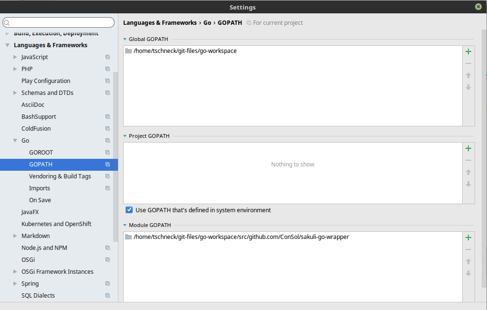

## Platform-independent Sakuli-Starter in Go
### Compile by your self
#### Requirements:
- Go 1.5

#### Installation
```bash
go get github.com/ConSol/sakuli-go-wrapper
```

- Own OS
```bash
go build github.com/ConSol/sakuli-go-wrapper
```

- Cross-Platform (Example is for compiling on Windows for Linux)
```bash
set GOOS=linux
set GOARCH=386
go build github.com/ConSol/sakuli-go-wrapper
```

- Build windows and linux binary
```bash
make
```
or 
```
mvn install
```
- IntelliJ Settings


### Usage

Execute:
 
    mvn install && target/classes/sakuli -help